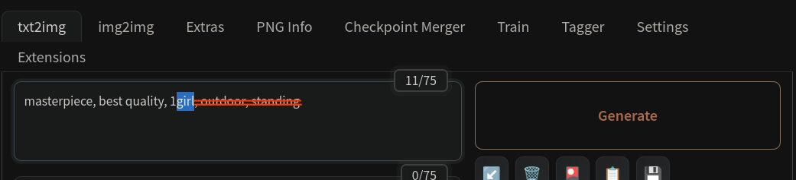
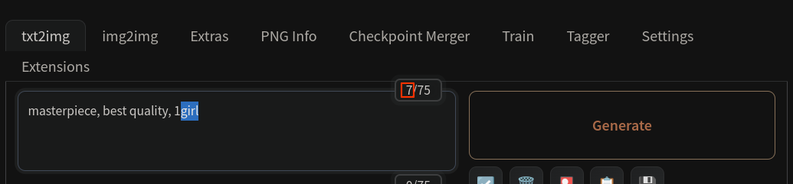

# Implementation of MasaCtrl in webui
https://arxiv.org/abs/2304.08465

## Disclaimer
The plugin at this stage is only a proof of concept for the backend logic of MasaCtrl, I created it mainly for testing vid2vid consistency using [Video Loopback](https://github.com/ashen-sensored/video_loopback_for_webui_with_masactrl).

I would not recommend end users without coding experience or not familiar with webui to use it, as it is not user friendly at all.

I welcome contributors who understand the internal logic of MasaCtrl to improve the following:

- [ ] improve UI, like visualizing xattn masks, log status management, etc.

## ADJUST YOUR FOREGROUND INDEXES ACCORDING TO YOUR PROMPT, OR IT WILL NOT WORK

When your target foreground keyword is the last token in positive prompt area, corresponding token index can be found at the top right corner of positive prompt as ( * /75), ( * /150), ...

 
For example:

## Prerequisites
Python 3.10 or later