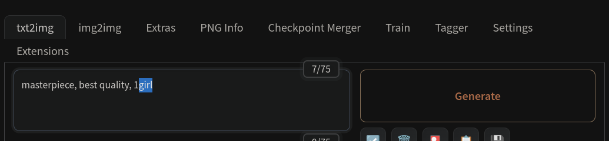
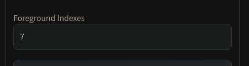

# Implementation of MasaCtrl in webui
https://arxiv.org/abs/2304.08465

## ADJUST YOUR FOREGROUND INDEXES ACCORDING TO YOUR PROMPT, OR IT WILL NOT WORK

When your target foreground keyword is the last token in positive prompt area, corresponding token index can be found at the top right corner of positive prompt as ( * /75), ( * /150), ...

 
For example:

## Prerequisites
Python 3.10 or later